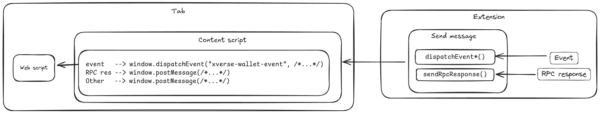

# Sending messages to the content script

To send messages to the content script, the extension environment provides [`chrome.tabs.sendMessage()`](https://developer.chrome.com/docs/extensions/reference/api/tabs#method-sendMessage). The methods for interacting with the content script or user applications build atop this method.

Each feature provides its own wrappers for sending messages as required,

The existing RPC methods have not yet been migrated to this area of the code.
